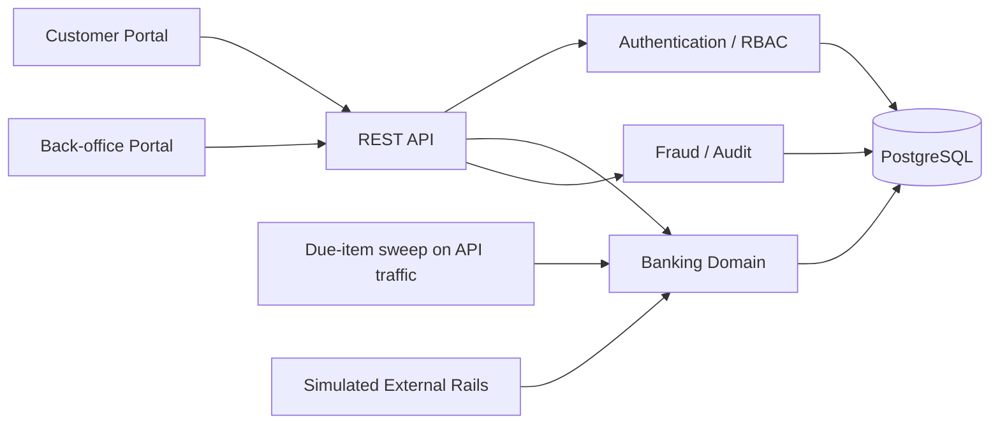

# NovaBank architecture

NovaBank is a simulated retail banking application designed for testability,
deterministic edge cases and cross-layer validation.

## Domain invariants

- Money is stored as integer minor units, never floating-point account balances.
- Money-moving operations execute inside database transactions.
- A failed transfer does not debit the source account.
- Same-bank transfers create matching debit and credit ledger records.
- Daily transfer limits and account states are checked before debit.
- Idempotency keys prevent accidental duplicate transfer creation.
- Reversals create compensating ledger records instead of deleting history.
- Audit events are append-only through the application API.
- RBAC is enforced server-side; hiding UI controls is not treated as authorization.
- KYC, loan, fraud and transfer workflows use explicit states that can be tested as state machines.

Every account balance must equal the `balance_after_minor` of that account's
most recent transaction. `npm run db:check` asserts this, and it is the single
most useful cross-layer check: it fails whenever a money movement updated a
balance without writing the matching ledger row, or the reverse.

## Persistence

PostgreSQL 14+. `database/postgres-schema.sql` defines 17 tables and is applied
by `npm run db:migrate`. `database/sqlite-reference.sql` is the schema this
application originally shipped with and is kept only so the port can be
diffed against it; nothing loads it.

Money and time are deliberately simple types. Amounts are `BIGINT` minor units.
Timestamps are ISO-8601 `TEXT`, which keeps lexicographic ordering equal to
chronological ordering and makes range filters in the API and in SQL assertions
read the same way.

`src/database.js` exposes `queryOne` / `queryAll` / `execute` /
`withTransaction`. Three details matter when writing tests against this layer:

- **Placeholders.** SQL is written with `?` and rewritten to `$1..$n` inside the
  helpers. This is a translation from the SQLite original, not a second dialect.
- **Transactions.** `withTransaction` pins one pooled client and publishes it
  through `AsyncLocalStorage`, so `BEGIN`, the statements inside, and `COMMIT`
  all run on the same connection. Nested calls join the outer transaction
  instead of opening a second one.
- **Integer types.** `BIGINT` and `NUMERIC` are parsed back to JavaScript
  numbers. node-postgres returns both as strings by default, which would make
  `account.id === userId` silently false.

## Concurrency

Money movements take row locks. Every account a transfer touches is locked in a
single `WHERE id = ANY(...) ORDER BY id FOR UPDATE` statement, so two
reciprocal transfers cannot deadlock by acquiring the same pair in opposite
orders. Balance, status and daily-limit checks all read from the locked rows,
never from an earlier unlocked read.

This is what makes concurrency testing meaningful. The expected behaviour under
contention is that the total debited never exceeds the available balance and no
balance goes negative — for example, five simultaneous transfers of 20,000
against a balance of 80,000 settle as four accepted, one rejected with `409`,
and a closing balance of exactly zero.

## Scheduled work

Scheduled transfers and bill payments are swept when API traffic arrives, at
most once every 30 seconds, rather than on a background timer. A serverless
invocation has no long-lived process to host a timer, so a timer-based
scheduler would work locally and silently do nothing in production. Traffic-
driven sweeping behaves the same in both.

## Request handling

`src/app.js` holds a route table of `[method, pattern, handler]`. Capture groups
are passed to handlers as `params`. The same exported handler serves both
`server.js` (a long-lived `node:http` server for local development and CI) and
`api/index.js` (the Vercel serverless entry), so there is one code path and no
environment-specific routing behaviour.

Static files are served from `public/`, with any unmatched path falling back to
`index.html` so client-side routes survive a reload.

## QA affordances

With `QA_MODE=true` the API returns the MFA code, email verification code,
password reset token and beneficiary OTP in its responses, and accepts a
`qaSimulation` field on transfers that forces a safe failure — the transfer is
recorded as `FAILED` and no account is debited. The `X-QA-Country` header drives
the unusual-login fraud rule. These exist so tests do not need a mail server or
a way to inject infrastructure faults; all of them are disabled when `QA_MODE`
is false.
