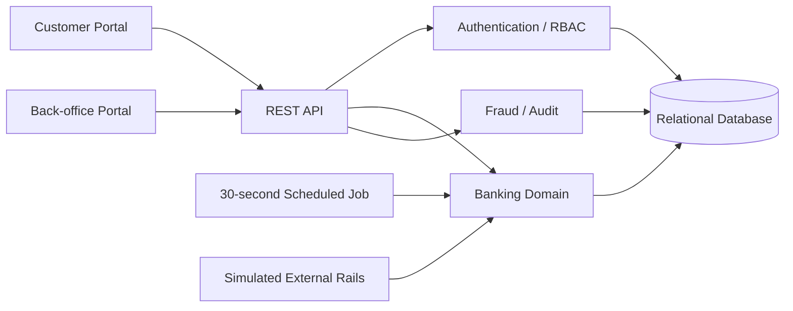

# NovaBank architecture

NovaBank QA Lab is a simulated retail banking application designed for testability, deterministic edge cases and cross-layer validation.

## Domain invariants

- Money is stored as integer minor units, never floating-point account balances.
- Money-moving operations execute inside database transactions.
- A failed transfer does not debit the source account.
- Same-bank transfers create matching debit and credit ledger records.
- Daily transfer limits and account states are checked before debit.
- Idempotency keys prevent accidental duplicate transfer creation.
- Reversals create compensating ledger records instead of deleting history.
- Audit events are append-only through the application API.
- RBAC is enforced server-side; hiding UI controls is not treated as authorization.
- KYC, loan, fraud and transfer workflows use explicit states that can be tested as state machines.

## Runtime database

The runnable bundle uses Node 22's built-in SQLite driver so the project starts without third-party dependencies. `database/postgres-schema.sql` mirrors the model and is the target schema for the PostgreSQL/database-testing phase. The domain/service boundary was kept separate so moving the persistence adapter to PostgreSQL does not require redesigning the UI or business workflows.
